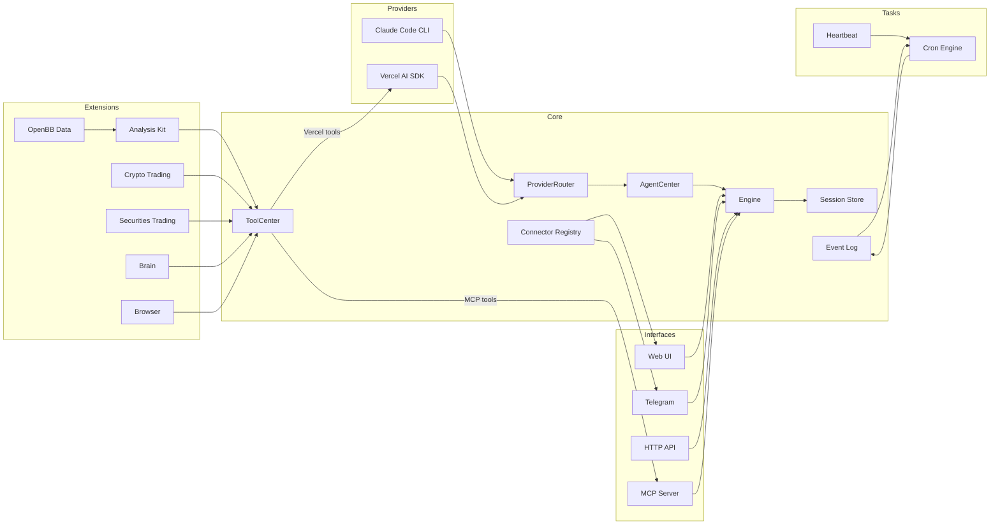

<p align="center">
  
</p>

<p align="center">
  <a href="https://github.com/ClawQuant/claw-quant">📖 Documentation</a> · <a href="https://github.com/ClawQuant/claw-quant/blob/master/LICENSE">MIT License</a>
</p>

<h1 align="center">ClawQuant</h1>

<p align="center">
  <strong>Your AI-powered quantitative trading desk</strong>
</p>

ClawQuant is a file-driven AI trading agent that gives you your own research desk, quant team, trading floor, and risk management — all running on your laptop 24/7. Built on the proven OpenAlice architecture with a quant-first, developer-friendly design.

- **File-driven** — Markdown defines persona and tasks, JSON defines config, JSONL stores conversations. Both humans and AI control Claw by reading and modifying files. The same read/write primitives that power vibe coding transfer directly to vibe trading. No database, no containers, just files.
- **Reasoning-driven** — Every trading decision is based on continuous reasoning and signal mixing. Claw reasons through market data, technical indicators, and risk parameters before executing.
- **OS-native** — Claw can interact with your operating system. Search the web through your browser, send messages via Telegram, and connect to local devices.

## Features

- **Dual AI provider** — Switch between Claude Code CLI and Vercel AI SDK at runtime, no restart needed
- **Crypto trading** — CCXT-based execution (Bybit, OKX, Binance, etc.) with a git-like wallet (stage, commit, push)
- **Securities trading** — Alpaca integration for US equities with the same wallet workflow
- **Market data** — OpenBB-powered equity, crypto, commodity, and currency data layers with symbol search and technical indicator calculator
- **Cognitive state** — Persistent "brain" with frontal lobe memory, emotion tracking, and commit history
- **Event log** — Persistent append-only JSONL event log with real-time subscriptions and crash recovery
- **Cron scheduling** — Event-driven cron system with AI-powered job execution and automatic delivery to the last-interacted channel
- **Evolution mode** — Two-tier permission system. Normal mode sandboxes the AI to `data/brain/`; evolution mode gives full project access including Bash, enabling the agent to modify its own source code
- **Web UI** — Built-in local chat interface on port 3002, no Telegram account needed

## Architecture



**Providers** — Interchangeable AI backends. Claude Code spawns `claude -p` as a subprocess; Vercel AI SDK runs a `ToolLoopAgent` in-process. `ProviderRouter` reads `ai-provider.json` on each call to select the active backend at runtime.

**Core** — `Engine` is a thin facade that delegates to `AgentCenter`, which routes all calls (both stateless and session-aware) through `ProviderRouter`. `ToolCenter` is a centralized tool registry — extensions register tools there, and it exports them in Vercel AI SDK and MCP formats. `EventLog` provides persistent append-only event storage (JSONL) with real-time subscriptions and crash recovery. `ConnectorRegistry` tracks which channel the user last spoke through.

**Extensions** — Domain-specific tool sets registered in `ToolCenter`. Each extension owns its tools, state, and persistence.

**Tasks** — Scheduled background work. `CronEngine` manages jobs and fires `cron.fire` events into the EventLog on schedule; a listener picks them up, runs them through the AI engine, and delivers replies via the ConnectorRegistry. `Heartbeat` is a periodic health-check that uses a structured response protocol (HEARTBEAT_OK / CHAT_NO / CHAT_YES).

**Interfaces** — External surfaces. Web UI for local chat, Telegram bot for mobile, HTTP for webhooks, MCP server for tool exposure. External agents can also [converse with Claw via a separate MCP endpoint](docs/mcp-ask-connector.md).

## Quick Start

### Prerequisites

- Node.js 22+
- pnpm 10+ or npm 10+

### Setup

```bash
git clone https://github.com/ClawQuant/claw-quant.git
cd claw-quant
pnpm install   # or: npm install
cp .env.example .env    # then fill in your keys
```

### AI Provider

ClawQuant ships with two provider modes:

- **Claude Code** (default) — Spawns `claude -p` as a subprocess, giving the agent full Claude Code capabilities. Requires [Claude Code](https://docs.anthropic.com/en/docs/claude-code) installed and authenticated on the host machine. No separate API key needed — uses your Claude Code login. To switch models, see [how to change Claude Code's model](https://docs.anthropic.com/en/docs/claude-code/settings#model-configuration).
- **Vercel AI SDK** — Runs the agent in-process. Supports any provider compatible with the [Vercel AI SDK](https://sdk.vercel.ai/docs) (Anthropic, OpenAI, Google, etc.). Swap the provider implementation in `src/providers/vercel-ai-sdk/` to use your preferred model. Requires an API key for your chosen provider (e.g. `ANTHROPIC_API_KEY` for Anthropic).

### Crypto Trading

Powered by [CCXT](https://docs.ccxt.com/). Defaults to Bybit demo trading. Configure the exchange and API keys in `data/config/crypto.json` and `.env`. Any CCXT-supported exchange can be used by modifying the provider implementation.

### Securities Trading

Powered by [Alpaca](https://alpaca.markets/). Supports paper and live trading — toggle via `data/config/securities.json`. Sign up at Alpaca and add your keys to `.env`. IBKR support is planned.

### Environment Variables

| Variable | Description |
|----------|-------------|
| `ANTHROPIC_API_KEY` | API key for Vercel AI SDK provider (not needed if using Claude Code CLI) |
| `EXCHANGE_API_KEY` | Crypto exchange API key (optional) |
| `EXCHANGE_API_SECRET` | Crypto exchange API secret (optional) |
| `TELEGRAM_BOT_TOKEN` | Telegram bot token (optional) |
| `TELEGRAM_CHAT_ID` | Comma-separated chat IDs to allow (optional) |
| `ALPACA_API_KEY` | Alpaca API key for securities (optional) |
| `ALPACA_SECRET_KEY` | Alpaca secret key for securities (optional) |

### Run

```bash
pnpm dev        # start backend (port 3002) with watch mode
pnpm dev:ui     # start frontend dev server (port 5173) with hot reload
pnpm build      # production build (backend + UI)
pnpm test       # run tests
```

### Web UI

The backend (port 3002) serves both the API and the built frontend from `dist/ui/`. During development, run `pnpm dev:ui` to start Vite's dev server on port 5173, which proxies API requests to port 3002 and provides hot module replacement.

| Port | What | When |
|------|------|------|
| 5173 | Vite dev server (hot reload) | `pnpm dev:ui` |
| 3002 | Backend API + built UI | `pnpm dev` / `pnpm build && node dist/main.js` |

> **Note:** Port 3002 only serves the UI after `pnpm build` (or `pnpm build:ui`). If you haven't built yet, use port 5173 for frontend development.

## Configuration

All config lives in `data/config/` as JSON files with Zod validation. Missing files fall back to sensible defaults.

| File | Purpose |
|------|---------|
| `engine.json` | Trading pairs, tick interval, HTTP/MCP ports, timeframe |
| `model.json` | AI model provider and model name |
| `agent.json` | Max agent steps, evolution mode toggle, Claude Code tool permissions |
| `crypto.json` | Allowed symbols, exchange provider (CCXT), demo trading flag |
| `securities.json` | Allowed symbols, broker provider (Alpaca), paper trading flag |
| `compaction.json` | Context window limits, auto-compaction thresholds |
| `heartbeat.json` | Heartbeat enable/disable, interval, active hours |
| `ai-provider.json` | Active AI provider (`vercel-ai-sdk` or `claude-code`), switchable at runtime |

Persona and heartbeat prompts use a **default + user override** pattern:

| Default (git-tracked) | User override (gitignored) |
|------------------------|---------------------------|
| `data/default/persona.default.md` | `data/brain/persona.md` |
| `data/default/heartbeat.default.md` | `data/brain/heartbeat.md` |

On first run, defaults are auto-copied to the user override path. Edit the user files to customize without touching version control.

## Project Structure

```
src/
  main.ts                    # Composition root — wires everything together
  core/
    engine.ts                # Thin facade, delegates to AgentCenter
    agent-center.ts          # Centralized AI agent management, owns ProviderRouter
    ai-provider.ts           # AIProvider interface + ProviderRouter (runtime switching)
    tool-center.ts           # Centralized tool registry (Vercel + MCP export)
    ai-config.ts             # Runtime provider config read/write
    session.ts               # JSONL session store + format converters
    compaction.ts            # Auto-summarize long context windows
    config.ts                # Zod-validated config loader
    event-log.ts             # Persistent append-only event log (JSONL)
    connector-registry.ts    # Last-interacted channel tracker
    media.ts                 # MediaAttachment extraction from tool outputs
    types.ts                 # Plugin, EngineContext interfaces
  providers/
    claude-code/             # Claude Code CLI subprocess wrapper
    vercel-ai-sdk/           # Vercel AI SDK ToolLoopAgent wrapper
  extension/
    analysis-kit/            # Indicator calculator and market data tools
    archive-analysis/        # Legacy market data layer (KlineStore, NewsStore)
    equity/                  # Equity search and data adapter
    crypto/                  # Crypto search and data adapter
    currency/                # Currency search and data adapter
    crypto-trading/          # CCXT integration, wallet, tools
    securities-trading/      # Alpaca integration, wallet, tools
    thinking-kit/            # Reasoning and calculation tools
    brain/                   # Cognitive state (memory, emotion)
    browser/                 # Browser automation bridge (via OpenClaw)
  openbb/
    equity/                  # OpenBB equity data layer (price, fundamentals, estimates, etc.)
    crypto/                  # OpenBB crypto data layer
    commodity/               # OpenBB commodity data layer (EIA, spot prices)
    currency/                # OpenBB currency data layer
  connectors/
    web/                     # Web UI chat (Hono, SSE push)
    telegram/                # Telegram bot (grammY, polling, commands)
    mcp-ask/                 # MCP Ask connector (external agent conversation)
  task/
    cron/                    # Cron scheduling (engine, listener, AI tools)
    heartbeat/               # Periodic heartbeat with structured response protocol
  plugins/
    http.ts                  # HTTP health/status endpoint
    mcp.ts                   # MCP server for tool exposure
  openclaw/                  # Browser automation subsystem (frozen)
data/
  config/                    # JSON configuration files
  default/                   # Factory defaults (persona, heartbeat prompts)
  sessions/                  # JSONL conversation histories
  brain/                     # Agent memory and emotion logs
  crypto-trading/            # Crypto wallet commit history
  securities-trading/        # Securities wallet commit history
  cron/                      # Cron job definitions (jobs.json)
  event-log/                 # Persistent event log (events.jsonl)
docs/                        # Architecture documentation
```

## Publishing to GitHub

To publish ClawQuant under your own account:

```bash
git add .
git commit -m "Initial commit: ClawQuant - AI-powered quantitative trading agent"
git branch -M main
git remote add origin https://github.com/ClawQuant/claw-quant.git
git push -u origin main
```

Create the `claw-quant` repository on GitHub first (empty, no README). Update the remote URL if your GitHub username differs from `ClawQuant`.

## Credits

ClawQuant is a rebranded fork of [OpenAlice](https://github.com/TraderAlice/OpenAlice) by TraderAlice. Built with ❤️ for quant traders and developers.

## License

[MIT](LICENSE)
